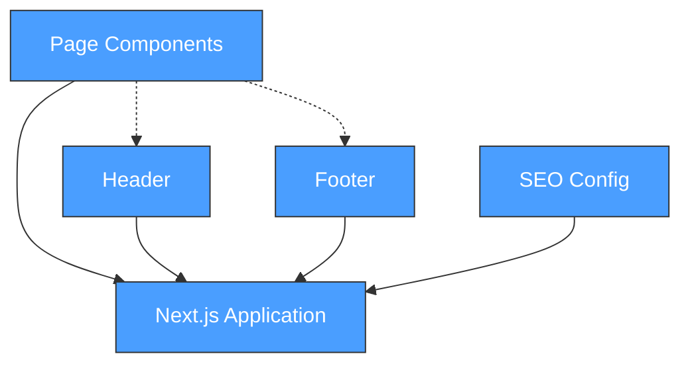

# Project Architecture

## Overview
Aqua Journey website - a swim school/aquatics business marketing site built with Next.js 16, React 19, and Tailwind CSS v4. Static/SSG site with multiple pages for services, testimonials, contact, and more.

## Design Principles
- Mobile-first responsive design
- Performance-focused (Core Web Vitals)
- Accessible (WCAG 2.1 AA target)
- SEO optimized
- Clean, maintainable code

## Component Map

> Auto-generated from `.project/architecture/components.json`
> Run `/sync architect` to regenerate

## Tech Stack
- **Framework**: Next.js 16.1.6
- **UI Library**: React 19.2.3
- **Styling**: Tailwind CSS v4
- **Language**: TypeScript 5
- **Build**: Turbopack (Next.js default)

## Pages
- `/` - Home page
- `/about` - About the business
- `/classes` - Swimming classes offered
- `/contact` - Contact information/form
- `/faq` - Frequently asked questions
- `/gift-cards` - Gift card purchasing
- `/scholarships` - Scholarship program
- `/testimonials` - Customer testimonials

## Constraints
- Browser support: Modern browsers
- Hosting: TBD (see DEPLOYMENT-GUIDE.md)
- No backend/database (static site)

## Technical Decisions
[To be documented as made - see also decisions.md]
