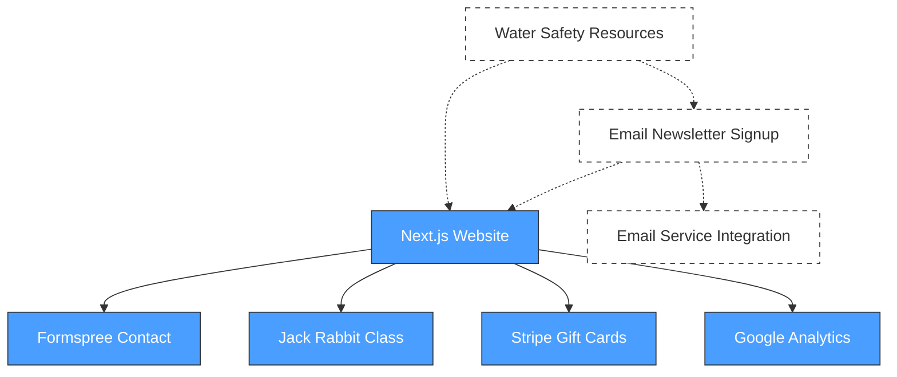

# Project Architecture

## Overview
Aqua Journey Swim School website - a Next.js 16 marketing site for a family-owned swim school in Ormond Beach, Florida. The site provides information about swim programs, class registration, and now adding email capture for water safety education content.

## Design Principles
- Static-first: No backend server required
- External integrations: Formspree, Stripe, Jack Rabbit Class
- Mobile-responsive: Tailwind CSS 4
- SEO optimized: Structured data, meta tags, sitemap
- Accessibility: Semantic HTML, ARIA labels, keyboard navigation

## Component Map

> Auto-generated from `.project/architecture/components.json`
> Run `/sync architect` to regenerate

## Tech Stack
- **Framework**: Next.js 16.1.6
- **UI**: React 19.2.3, Tailwind CSS 4
- **Language**: TypeScript 5
- **Forms**: Formspree
- **Payments**: Stripe (gift cards)
- **Registration**: Jack Rabbit Class
- **Analytics**: Google Analytics 4

## Constraints
- No backend infrastructure (static site)
- Use existing brand colors (blue #03a9f4, orange #f79007)
- Mobile-first responsive design
- Maintain existing SEO optimization

## Technical Decisions
- 2026-02-23: Use existing Formspree integration or similar service for email capture (no new backend needed)
